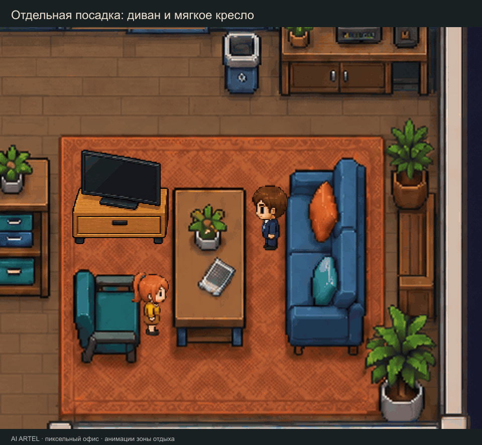

# AI Artel · пиксельный офис

Готовые ассеты для офисной сцены: 7 персонажей, 1792 кадра основных действий, 1239 новых кадров мягкой мебели и совместного отдыха, три анимированные двери. Для каждого персонажа доступны 32 основных и 50 дополнительных направленных клипов. Левые клипы дополнения используют зеркало, вставание — обратные кадры посадки.

## Посмотреть

- [Зона отдыха, мягкая мебель и PlayStation](08_LOUNGE_AND_SOCIAL/index.html) — выбор любой пары сотрудников, посадки, питьё, разговор, смех, игра, ящик, перенос приставки и парные жесты.
- [Двери и проход](07_DOOR_ANIMATIONS/index.html) — кабинет руководителя, переговорная и внешний вход в офис; вход и выход сотрудников.
- [Основные действия персонажей](06_CHARACTER_ANIMATIONS/index.html).

Скачайте репозиторий и откройте index.html в браузере: просмотр работает с диска без сервера. В зоне отдыха добавлены телевизор и тумба; шкаф перед входом перенесён выше, чтобы освободить подход.

[Видео отдыха](08_LOUNGE_AND_SOCIAL/previews/lounge-actions.mp4) · [Цикл приставки](08_LOUNGE_AND_SOCIAL/previews/playstation-cycle.mp4) · [Двери](07_DOOR_ANIMATIONS/previews/doors-passage.mp4).

## Внедрение

Начните с [инструкции разработчику](08_LOUNGE_AND_SOCIAL/DEVELOPER_START.md): в ней подготовлено задание для агента. Откройте в агенте код целевого приложения и дайте доступ к актуальным папкам **06_CHARACTER_ANIMATIONS**, **07_DOOR_ANIMATIONS**, **08_LOUNGE_AND_SOCIAL** и их инструкциям **AGENT_HANDOFF.md**. Для сборки всей сцены передайте также исходные 01, 02 и 03.

Агент должен выбирать анимацию по типу мебели, сохранять точку ног при смене атласа, подключать двери к маршрутам и коллизиям, синхронизировать передачу предмета и управлять одной приставкой с двумя контроллерами. Полный справочник сценариев и событий находится в [инструкции нового набора](08_LOUNGE_AND_SOCIAL/AGENT_HANDOFF.md).

Репозиторий содержит графику, работающий просмотр и примеры контроллеров. Подключение к реальным задачам и навигации выполняется в целевом приложении; его исходников здесь нет.

## Папки и архивы

| Папка | Содержание |
| --- | --- |
| 00_PREVIEW | Исходные превью |
| 01_STATIC_SCENE | Исходная офисная сцена |
| 02_ANIMATION | Исходный фон без персонажей |
| 03_INDIVIDUAL_TRANSPARENT_ASSETS | Отдельная мебель и предметы |
| 04_CHARACTER_MODELS | Исходные модели персонажей |
| 05_DOCUMENTATION | Документация исходного набора |
| 06_CHARACTER_ANIMATIONS | Основные действия персонажей и актуальный выбор мебели |
| 07_DOOR_ANIMATIONS | Три двери, открытые проёмы и контроллер прохода |
| 08_LOUNGE_AND_SOCIAL | Диван, мягкое кресло, общение, телевизор, приставка и инструкции |

**AI_ARTEL_DOOR_ANIMATIONS_V2.zip** и **AI_ARTEL_LOUNGE_AND_SOCIAL_V1.zip** — актуальные дополнения. Распакуйте рядом с основным набором, сохраняя названия папок. Архивы персонажей v2/v3 и дверей V1 остаются историческими снимками; при работе с архивами используйте обновлённый seating.json из дополнения 08 вместо старой копии в 06.

Исходники генерации и задания image_gen сохранены в sources/ и docs/GENERATION_PROMPTS.json. Готовые атласы и кадры уже упакованы — перерисовывать или заново резать листы не нужно.

Архив **AI_ARTEL_LOUNGE_SOURCES_V1.zip** хранит исходные листы нового набора отдельно от готового дополнения; для обычного внедрения он не требуется.
