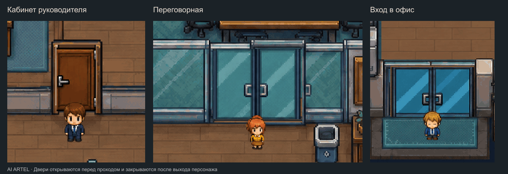

# AI Artel · пиксельный офис

Готовые ассеты для офисной сцены: 7 персонажей, 32 действия на каждого, 1792 кадра и анимированные двери кабинета руководителя и переговорной.

## Посмотреть

- [Анимации персонажей](06_CHARACTER_ANIMATIONS/index.html) — скачайте репозиторий и откройте файл в браузере.
- [Двери и проход](07_DOOR_ANIMATIONS/index.html) — обе двери в исходной сцене, вход и выход персонажей, крупные планы.
- [Видео дверей](07_DOOR_ANIMATIONS/previews/doors-passage.mp4).

## Внедрение

Откройте в агенте код приложения, которое будет показывать офис. Дайте ему доступ к этому репозиторию целиком или скопируйте в проект обе папки **06_CHARACTER_ANIMATIONS** и **07_DOOR_ANIMATIONS**. Для сборки всей сцены также понадобятся исходные папки 01_STATIC_SCENE, 02_ANIMATION и 03_INDIVIDUAL_TRANSPARENT_ASSETS.

Прочитайте [состав персонажей](06_CHARACTER_ANIMATIONS/README_RU.md) и [состав дверей](07_DOOR_ANIMATIONS/README_RU.md). Затем передайте агенту задание:

> Внедри персонажей и двери AI Artel в существующее приложение. Сначала изучи код приложения, 06_CHARACTER_ANIMATIONS/AGENT_HANDOFF.md, 07_DOOR_ANIMATIONS/AGENT_HANDOFF.md и manifest.json/seating.json. Используй готовые атласы и реальные задачи, маршруты и события проекта. Подключи все доступные действия персонажей, корректные переходы сидя/стоя и резервирование мебели. Для дверей используй фон с чистыми проёмами, ожидание полного открытия, очередь прохода и безопасное закрытие. Проверь обе двери в обе стороны и сценарии работы, встречи и отдыха. Запусти приложение, покажи итоговую сцену, выполненные проверки и оставшиеся ограничения.

Этот репозиторий содержит ассеты, просмотр и вспомогательный контроллер дверей. Подключение к конкретному игровому движку и его навигации выполняется в целевом приложении.

## Папки

| Папка | Содержание |
| --- | --- |
| 00_PREVIEW | Исходные превью |
| 01_STATIC_SCENE | Исходная офисная сцена |
| 02_ANIMATION | Фон без персонажей и исходная анимация |
| 03_INDIVIDUAL_TRANSPARENT_ASSETS | Отдельная мебель и предметы |
| 04_CHARACTER_MODELS | Исходные модели персонажей |
| 05_DOCUMENTATION | Документация исходного набора |
| 06_CHARACTER_ANIMATIONS | Персонажи, сидячие действия, превью и инструкции |
| 07_DOOR_ANIMATIONS | Двери, открытые проёмы, контроллер прохода и инструкции |

Архивы персонажей v2/v3 сохранены как отдельные версии. Новые двери поставляются отдельным дополнением **AI_ARTEL_DOOR_ANIMATIONS_V1.zip**; для внедрения вместе с персонажами распакуйте оба набора рядом, сохранив названия папок.
